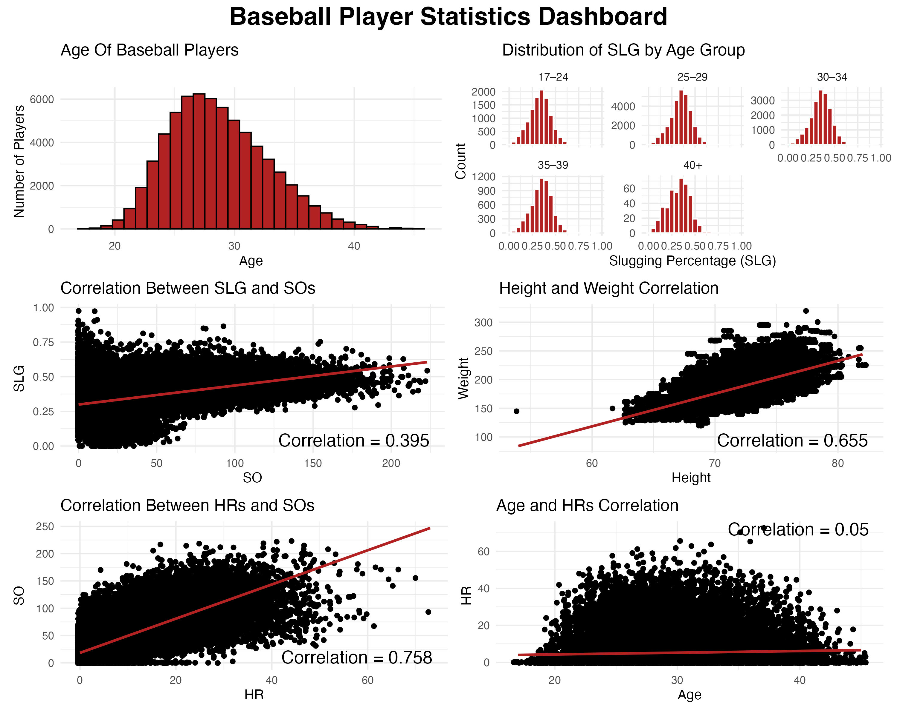
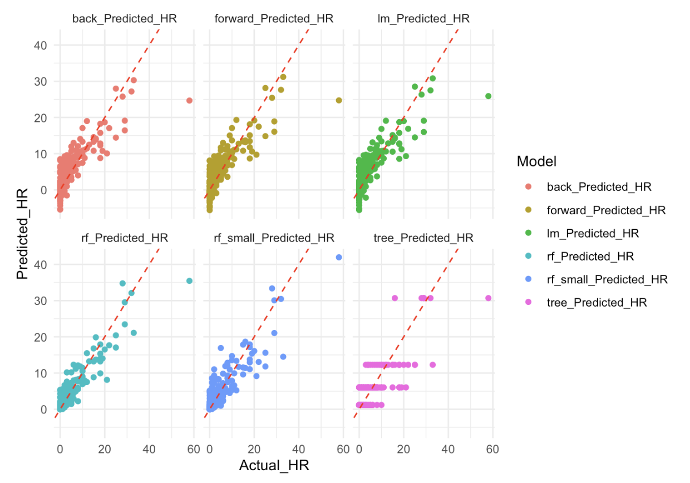

# Baseball-HR-Predictions
Using Lahman Baseball Database to try and create a model to predict HRs.
I decided to use age, weight, height, at-bats, strikeouts, hits and slugging percentage to predict home runs.
I chose these variables because age can play a role in hitting home runs as it is easier for people in their prime mid-20s compared to when they are 40. I used height and weight because that also plays a role and if you are smaller in size and stature it is harder to hit home runs than bigger people. I also chose at-bats and hits because I think that they play an important role and without a lot of both hitting a lot of home runs would be pretty difficult. I chose strikeouts because I was curious to see how much that could help predict as "power" hitters tend to strikeout more so I was interested to see if it would play a role here. I chose slugging percentage because that is usually indicative of how much a player hits and hits for more than just a single.

Before creating the models I wanted to see look at the correlations between some things as well as look a little more into the age aspect of it. First, I created a histogram of players and ages just to see with the data I have, who we had. It appears as expected that there is a significant peak in the mid to late 20s and as you get younger or older than that, teh number of players starts to decrease. I then decided to look at the distribution of slugging percentage by age and interestingly it seems that age might not have a huge effect on slugging percentage as at all ages the most common slugging percentages are similar. It becomes a little more varied in the 40s but that also makes sense because there is a much smaller sample size. Getting into the correlations, I first decided to look at strikeouts and slugging because I was curious to see if the discussion about "power" hitters striking out more was correlated to slugging. From the graph and value, it appears that there is a weak to moderate positive correlation between the two indicating that there could be some truth to the discussion. I then looked at the correlation between height and weight to see what that correlation was like and if there was a lot or not. As expected, there is a strong positive correlation between the two. However, it was not as strong as I had expected it to be but it makes sense since in baseball there are a lot of different make ups of players. I then decided to look into the strikeouts and home run correlation to see if the talk about "power" hitters had data to back it up and as we can see, there is a strong positive correlation between the two meaning that if you hit a lot of home runs it is likely that a good number of strikeouts will come with it. I lastly decided to look at age and HRs to see if age mattered a lot with home runs and to my surprise, there is a very weak correlation between the two meaning that age might not matter as much as I originally thought.

For the models, I chose the linear model because it is a simple model to use and interpret that also sets a good base line for the models on predicting HRs. I chose the tree model because it is a more complex model than the LM and is a simple tree that takes more into account than the LM. I chose the Random Forrest model because it is a really good predictor and is usually accurate as well as it is good with different variable types. I also chose to use a Random Forrest model with less predictors because I felt that taking the predictors out of this model might help it to perform better. I chose the backwards and forwards models because it is pretty simple and will help determine which variables are important and which are not.

Looking at the models, it appears that all of the models have similar RMSE, MAE and R^2 scores. The Random Forrest model performed the best on all 3. It had the best RSME value being the only model under 3 meaning that its predictions had the closest values to the actual ones and does not have many significant errors and was the most accurate. It also had the best MAE being the only model under 2 also indicating that it is the most accurate. Finally it had the best R^2 value with .898 meaning that the model explained about 90% of the variability in HRs are explained by the model. Overall, the Random Forrest model performed the best of all of the models and the smaller Random Forrest model was close behind.

Some limitations of these models are that it does not take into account any hitting metrics like exit velocity, launch angle or bat speed which are important when determining if a batted ball may be a home run. It also does nto take into account park factors as some batted balls could be home runs in some ballparks but not in others. Another limitation is that this data stretches across over 120 years and the game has changed a lot so using data from guys who played in the early 1900s will probably not help determine number of home runs today. If I had more resources and time, I would use exit velocity, launch angle and bat speed as well as park factors to help improve this model.
